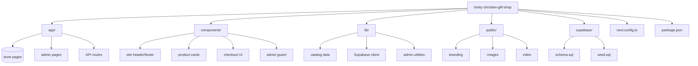

# Trinity Christian Gift Shop

Production-oriented Next.js + Supabase starter for Trinity Christian Gift Shop. No online payment is included.

## Stack
- Next.js 16 / React 19 / TypeScript
- Tailwind CSS
- Motion for UI animation
- Supabase Auth + PostgreSQL + Storage
- Lucide icons

## Project list
- `app/` — storefront pages, admin pages, and API routes
  - `app/(store)/` — public storefront pages such as shop, product details, gift finder, gift list, occasions, and contact
  - `app/admin/` — admin dashboard and management screens
  - `app/api/` — backend endpoints for products, requests, settings, and auth actions
- `components/` — reusable UI pieces such as headers, cards, footer, admin guard, and checkout flow
- `lib/` — shared logic for catalog data, admin checks, and Supabase clients
- `public/` — static assets, branding, and the hero video placeholder
- `supabase/` — SQL schema and seed scripts for database setup
- `next.config.ts` — Next.js configuration
- `package.json` — app scripts and dependencies

## Folder overview

## Main features
- Cinematic/pattern-based storefront with the supplied cross-pattern background
- Shop, product details, occasions, Gift Finder, Gift List, story, journal, contact
- Accessible product hover/focus action rail: image gently scales and actions appear
- Quantity-aware Gift List
- WhatsApp checkout with customer details, item names, quantities and estimated total
- Admin switch to enable/disable WhatsApp checkout
- Admin WhatsApp business number setting
- Admin authentication and active-admin role check
- Product CRUD + image upload to Supabase Storage
- Request/order list + status updates
- Supabase schema, RLS policies, admin roles and public settings
- Empty states when catalog or content data is not available

## Supabase setup
1. Create a Supabase project.
2. Run `supabase/schema.sql` in the SQL editor.
3. Optionally run `supabase/seed.sql` for the demo catalog.
4. Create an Auth user for the store administrator.
5. Add that user's UUID to `public.admin_users` (or insert it with SQL).
6. Copy `.env.example` to `.env.local` and fill in:
   - `NEXT_PUBLIC_SUPABASE_URL`
   - `NEXT_PUBLIC_SUPABASE_ANON_KEY`
   - `SUPABASE_SERVICE_ROLE_KEY` (server-only; never expose this in client code)
7. Run `npm install` then `npm run dev`.
8. Open `/admin/login` and configure Admin → Settings → WhatsApp checkout.

## WhatsApp behavior
When **WhatsApp checkout is ON** and a business number is configured, the customer fills in their details and is redirected to WhatsApp with a prefilled message containing:
- customer name
- phone
- email if supplied
- occasion
- notes
- every product
- quantity
- line totals
- estimated total

A request is also recorded in Supabase before opening WhatsApp (best-effort, so a temporary DB failure does not prevent the customer from contacting the store).

When **WhatsApp checkout is OFF**, the same checkout modal submits a normal request to Supabase and does not open WhatsApp.

## Hero video
Put the final cinematic hero video in `public/video/hero.mp4` and wire it into the hero section. The placeholder file documents this location.
